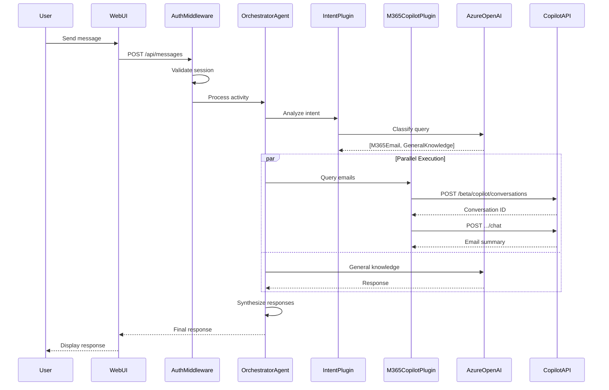

# Microsoft 365 Copilot Chat API + Agents SDK Lab

## Why Microsoft 365 Copilot in Your Agent Architecture?

As AI applications evolve toward **multi-agent architectures**, the question isn't whether to use multiple agents—it's which agents provide the most value. **Microsoft 365 Copilot** offers unique capabilities that no custom RAG pipeline can easily replicate:

- **Enterprise Data Grounding** — Responses based on real emails, meetings, files, and org data
- **Built-in Security** — Respects M365 permissions; no separate access control layer needed
- **Semantic M365 Understanding** — Knows relationships between people, meetings, documents, and conversations
- **Zero Pipeline Maintenance** — No vector databases or embedding pipelines for M365 content

This lab demonstrates how to build a **.NET 10 Agent** using the **Microsoft 365 Agents SDK** with **Semantic Kernel** orchestration, integrating M365 Copilot as a specialist agent.

## Architecture Overview

```
┌─────────────────────────────────────────────────────────────┐
│                    MULTI-CHANNEL CLIENTS                    │
│        Teams  |  M365 Copilot  |  Web  |  Slack             │
└─────────────────────────────────────────────────────────────┘
                              │
                    Activity Protocol
                              │
┌─────────────────────────────────────────────────────────────┐
│              MICROSOFT 365 AGENTS SDK                       │
│                                                             │
│  ┌───────────────────────────────────────────────────────┐  │
│  │         OrchestratorAgent : AgentApplication          │  │
│  │                                                       │  │
│  │   OnActivity(Message) → Semantic Kernel → Plugins     │  │
│  └───────────────────────────────────────────────────────┘  │
│                              │                              │
│  ┌───────────────────────────────────────────────────────┐  │
│  │               SEMANTIC KERNEL PLUGINS                 │  │
│  │  IntentPlugin | AzureOpenAIPlugin | M365CopilotPlugin │  │
│  └───────────────────────────────────────────────────────┘  │
└─────────────────────────────────────────────────────────────┘
           │                                    │
           ▼                                    ▼
┌─────────────────────┐          ┌─────────────────────────────┐
│   AZURE OPENAI      │          │   M365 COPILOT CHAT API     │
│   (GPT-4o)          │          │   (/beta/copilot via Kiota) │
└─────────────────────┘          └─────────────────────────────┘
```

## Technology Stack

| Component | Technology |
|-----------|------------|
| **Agent Framework** | Microsoft 365 Agents SDK 1.1.x |
| **Orchestration** | Semantic Kernel 1.54.x |
| **AI Model** | Azure OpenAI (GPT-4o) |
| **M365 Integration** | Microsoft Graph Copilot Chat API |
| **Runtime** | .NET 8 |

## Quick Start

### Prerequisites

- .NET 8 SDK
- Microsoft 365 tenant with Copilot license
- Microsoft 365 tenant with Ability to create teams apps
- Azure subscription with Azure OpenAI access
  - Configured Azure Open AI with a gpt-4o-mini model
- Azure AD app registration permission or appID with secret


### Setup

1. **Clone and navigate to the project:**
   ```bash
   cd AgentOrchestrator
   ```

## Features

- **M365 Agents SDK** - Enterprise-grade agent framework with multi-channel support
- **Semantic Kernel Plugins** - Clean AI function architecture
- **Multi-Intent Detection** - Routes queries to appropriate plugins
- **Parallel Execution** - Multiple plugins execute concurrently
- **M365 Copilot Integration** - Query emails, calendar, files, and people

## Example Queries

| Query Type | Example |
|------------|---------|
| Email | "Summarize my unread emails from this week" |
| Calendar | "What meetings do I have tomorrow?" |
| Files | "Find the latest project proposal document" |
| People | "Who has expertise in Azure in my team?" |
| General | "Explain what microservices are" |
| Multi-Intent | "Summarize my emails and explain REST APIs" |

## Project Structure

```
src/AgentOrchestrator/
├── Program.cs                 # App entry, DI, agent registration
├── Agent/
│   └── OrchestratorAgent.cs   # AgentApplication implementation
├── Plugins/                   # Semantic Kernel plugins
│   ├── IntentPlugin.cs
│   ├── AzureOpenAIPlugin.cs
│   ├── M365CopilotPlugin.cs
│   └── SynthesisPlugin.cs
├── CopilotSdk/                # Kiota-generated API client
├── Auth/                      # Authentication components
├── Models/                    # Data models
└── wwwroot/                   # Web UI
```

## Documentation

- [Design Document](DESIGN.md)
- [Self-Paced Lab Guide](docs/self-paced/LAB_GUIDE.md)
- [Prerequisites](docs/self-paced/PREREQUISITES.md)
- [Troubleshooting](docs/self-paced/TROUBLESHOOTING.md)
- [Instructor Guide](docs/instructor-led/FACILITATOR_GUIDE.md)

## Key Concepts

### Microsoft 365 Agents SDK

The M365 Agents SDK provides the foundation for building enterprise agents:
- **AgentApplication** - Base class for agent logic
- **Activity Protocol** - Standard message format (Bot Framework compatible)
- **Multi-Channel** - Deploy to Teams, M365 Copilot, Web, Slack, and more

### Semantic Kernel

Semantic Kernel provides AI orchestration:
- **Plugins** - Encapsulate AI functions with `[KernelFunction]` attributes
- **Kernel** - Manages AI services and plugin invocation
- **Prompts** - Natural language templates for LLM interactions

### M365 Copilot Chat API

The Copilot Chat API (`/beta/copilot/conversations`) enables:
- Programmatic access to M365 Copilot via Kiota-generated SDK
- Enterprise data grounding (emails, calendar, files, people)
- Synchronous conversational interactions

---

## For Lab Participants

### Security Notice

This lab uses simplified patterns for educational purposes. Pay attention to these markers in the code:

| Marker | Meaning |
|--------|---------|
| `// SECURITY:` | Security best practices - important to understand |
| `// LAB SIMPLIFICATION:` | Patterns that need hardening for production |
| `// PRODUCTION:` | What you'd do differently in production |

**Key differences from production code:**
- **Secrets:** Lab uses `appsettings.json` template; production uses Azure Key Vault
- **Token Cache:** Lab uses in-memory; production uses Redis or SQL Server
- **Session Storage:** Lab uses in-memory; production uses distributed cache
- **HTTP:** Lab runs on HTTP; production requires HTTPS

### Common Issues

See [TROUBLESHOOTING.md](docs/self-paced/TROUBLESHOOTING.md) for solutions to common problems.

### Request Flow Diagram



### Learning Objectives

After completing this lab, you should understand:

1. **Microsoft 365 Agents SDK** - How to build agents using `AgentApplication`
2. **Semantic Kernel** - Plugin pattern with `[KernelFunction]` attributes
3. **OAuth 2.0** - Authorization code flow with MSAL
4. **M365 Copilot Chat API** - Two-step conversation pattern
5. **Resilience Patterns** - Retry, circuit breaker, and timeout handling

## License

This lab is provided for educational purposes.
